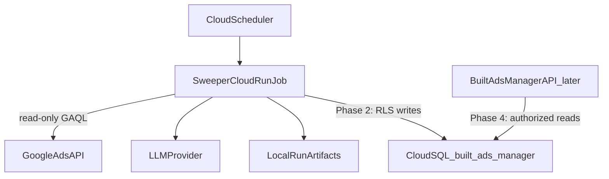

# Phase 1: Shared sweeper schema and least-privilege access in Built Ads Manager

The controlling requirements are [docs/SHARED_DATABASE_AND_ADS_MANAGER_INTEGRATION_PLAN.md](../../docs/SHARED_DATABASE_AND_ADS_MANAGER_INTEGRATION_PLAN.md), especially sections 5, 7, 10, and 11. This document refines their Phase 1; abbreviated field lists do not supersede them. Before implementation, recheck both repositories’ instructions, working trees, branch state, and migration numbering. Schema belongs in `/Users/aliamin/Documents/Work/built-ads-manager` (expected next file: `packages/db/migrations/0018_negative_keyword_sweeps.sql`; use the next free number). Do **not** put a second migration authority in the sweeper repo.

## What this step is (and is not)

This step prepares and locally verifies the **schema and access setup**. It does **not** change a deployed database or start saving production runs. Editing this plan is not execution of its implementation or operational steps.

- Sweeper continues as today: Google Ads read-only fetch, LLM classification, `runs/` JSON/CSV/XLSX, email.
- No `DATABASE_URL` / `ORGANIZATION_ID` / `pg` in the sweeper yet (that is Phase 2).
- No BAM API or UI (Phases 4–5). Scope-lock currently admits no new pages/routes.
- Do **not** apply this migration to Dev/Staging/Production Cloud SQL until you explicitly authorize it. The deliverables are SQL, access/setup scripts, documentation, and local test evidence.

The BAM link is already designed: each sweeper Ads customer maps to an existing `client_accounts` row via `(organization_id, google_customer_id)` (`char(10)`). Unknown, archived, or cross-tenant customers fail closed later; the schema will **refuse** orphan rows because `account_id` is a required composite FK. We will **not** auto-create client accounts.

## Implementation choices within the controlling requirements

- Keep sweeper evidence separate from BAM `sync_runs` ingestion records.
- Avoid duplicating high-volume evidence into generic `audit_events`. Document how immutable snapshots, retained evidence, restricted grants, and low-volume lifecycle audit satisfy the security/retention contract. An `updated_at` trigger alone is not an audit trail.
- Keep environment-specific role/login provisioning outside the schema migration, but include its prepared scripts, grants, and permission tests in Phase 1. Never substitute the broad `bam_app_runtime` role for the dedicated sweeper identity.
- **Locked grant split:** after 0018, `bam_app_runtime` (web + current worker) gets **SELECT only** on the 11 new tables. Revoke INSERT/UPDATE/DELETE/TRUNCATE that default privileges would otherwise grant. The dedicated sweeper role gets SELECT on `organizations`, `advertising_data_connections`, and `client_accounts`; SELECT/INSERT on snapshots; SELECT/INSERT/UPDATE on lifecycle tables (`sweep_runs`, `sweep_account_runs`, `llm_batches`, `report_deliveries`); SELECT/INSERT on the remaining evidence tables; no DELETE/TRUNCATE anywhere. Web SELECT now does not admit a browser API.
- **Locked grant-helper behavior:** keep the existing blanket `GRANT` on all tables in `dev-runtime-grants.ts`, then in the **same transaction** apply the sweeper-table exception (`REVOKE INSERT, UPDATE, DELETE, TRUNCATE` + `GRANT SELECT` on all 11). Do not replace BAM’s blanket grants with a full table whitelist. The helper must use the configured runtime role. Tests must run migrate + runtime-grant **twice**.
- **Locked mutability:** insert-only (reject UPDATE and DELETE via trigger) for snapshots, facts, candidates, decisions, attempts, events, and errors. UPDATE is allowed only on `negative_keyword_sweep_runs`, `negative_keyword_sweep_account_runs`, `negative_keyword_llm_batches`, and `negative_keyword_report_deliveries`; batch updates are restricted as described below. The decision INSERT trigger still reads the candidate through its organization-aware FK and rejects `negative_exact` when `negative_text` is not literally identical to `candidates.search_term`.
- **Locked batch UPDATE enforcement:** a `BEFORE UPDATE` trigger is the source of truth (protected columns unchanged; terminal status cannot be rewritten; allowed lifecycle/outcome columns only). Sweeper column-level `GRANT UPDATE (…)` is defense in depth if it stays maintainable; do not rely on grants alone.
- **Locked Phase 1 insert-or-verify:** unique constraints plus an integration-test helper that SELECTs the existing row and compares canonical content. Identical fixtures are treated as reuse; differing content is detected without UPDATE. No `ON CONFLICT DO UPDATE` / unchecked `DO NOTHING` in schema. No stored procedure for this in Phase 1; production retry/import remains Phases 2–3.
- Use BAM lowercase database enums; Phase 2 explicitly maps the sweeper’s uppercase values at the persistence boundary.
- Next BAM decision id is **D-048**. Record founder-approved schema/access admission there; do not admit UI/API/mutation.
- UI composition and API implementation remain later phases. Security, acceptance, operations, and product-decision documentation relevant to the schema/access change remain required now.

## Scope admission (required before the SQL)

BAM [docs/product/scope-ledger.md](file:///Users/aliamin/Documents/Work/built-ads-manager/docs/product/scope-ledger.md) currently says Negative-keyword logging is **Future only / No schema**. A migration without that update is a product-lock violation.

Before implementation, record the founder-approved admission for **schema and prepared access for observation-only logging** in the BAM decision log and ledger. Do not represent this plan edit as admission of later UI/API or cloud execution:

- Durable tables for read-only sweep evidence.
- Still **no** browser API, **no** UI tab, **no** Google Ads mutation, **no** rerun/backfill controls.

Update in the same BAM change:

- `docs/product/scope-ledger.md` (row + keep “no writes” in Deferred)
- `docs/component-map.md` (move off “Future only / no schema”)
- `docs/api-ownership.md` (schema exists; still no browser API)
- `docs/product/decisions.md` (approved scope and interpretations)
- `docs/security/threat-model.md` (tenant boundaries, dedicated role, sensitive evidence, immutability)
- `docs/acceptance-matrix.md` (schema/access/rollback proof and explicit deferred gates)
- `docs/operations.md` and `docs/what-we-use.md` (prepared setup, seven-year retention, rollout prerequisites; no claim of applied infrastructure)
- `docs/status.md` (completed work, actual evidence, blockers, next verified step)
- `docs/architecture.md` (schema, lineage, access, and evidence ownership)
- Sweeper plan status line in [docs/SHARED_DATABASE_AND_ADS_MANAGER_INTEGRATION_PLAN.md](../../docs/SHARED_DATABASE_AND_ADS_MANAGER_INTEGRATION_PLAN.md) so the two repos stay aligned

No new account tab, System Health section, or page/API allowlist entries. Update and run applicable documentation/scope-lock checks without admitting deferred surfaces. Full Phase 0 UI/API specification remains tracked as deferred; do not mark all of Phase 0 complete.

## Tables in `0018_negative_keyword_sweeps.sql`

Follow BAM conventions from `0012` / `0015`: `uuid`, `timestamptz`, `organization_id`, `UNIQUE (organization_id, id)` on parents, composite FKs, `ENABLE` + `FORCE` RLS, `organization_isolation` policy, `-- +up` / `-- +down` with “refuse rollback while evidence exists”.

Match existing fact types: `impressions`/`clicks`/`cost_micros` as `bigint >= 0`; `conversions` / `conversion_value` as `numeric(20,6)`; Google customer IDs as `char(10)` `^[0-9]{10}$`; campaign/ad-group IDs as `text` snapshots of what the sweeper actually fetched (evidence, not a join onto `campaign_daily_metrics`).

**1. `negative_keyword_rule_snapshots`**  
Immutable rules markdown; reject runtime UPDATE/DELETE using restricted privileges and a mutation-rejection trigger. Unique `(organization_id, content_sha256)`. `rule_version`, `prompt_version`, `source_path`, `rules_markdown`.

**2. `negative_keyword_sweep_runs`**  
One invocation. Unique `(organization_id, run_key)` (current sweeper `runId`). Unique `(organization_id, execution_key)` where `execution_key` is present (Cloud Run retry identity; unused until Phase 2). Status `queued | running | partial | succeeded | failed`. Trigger `scheduled | manual | historical_import`. `read_only = true` and `google_ads_mutation_performed = false` as CHECKs. Counts `>= 0`. Completed statuses require `completed_at`. Organization-aware FK to rule snapshot, nullable only before snapshot creation or on an early failed invocation; require it for success. Preserve requested date and its CLI/automatic origin, scheduler timezone, campaign filter, selection mode, concurrency/batch/limit snapshots, all account/raw-row/candidate/decision counters, normalized token totals and reconciliation flag, artifact contract version, lifecycle timestamps, and safe fatal error code/message (no stacks). Enforce nonnegative counters and succeeded + partial + failed account counts <= selected accounts. Phase 2 must reconcile child totals transactionally before success; row CHECKs do not prove that reconciliation.

**3. `negative_keyword_sweep_account_runs`**  
One selected BAM `client_accounts` row per run. Unique `(sweep_run_id, account_id)`. Composite FK to `client_accounts (organization_id, id)`. Snapshot name/timezone/currency. Account-local start/end dates, explicit status set and lifecycle timestamps, raw/scoped/available/processed candidate counts, decision/failed-batch/error counters, normalized token totals, fixed-input-token count metadata (definition, model, counted time, provider request ID, attempt/retry counts), and safe terminal error. Define zero-result success and terminal timestamp rules. Archived-account rejection is a Phase 2 lookup rule; a foreign key alone does not enforce it.

**4. `negative_keyword_search_term_facts`**  
Exact Google Ads rows. Unique `(sweep_account_run_id, source_row_hash)` with `source_row_hash char(64)`. Metric date, channel, campaign/ad-group snapshots, full search term, targeting/match context, metrics, `fetched_at`.

**5. `negative_keyword_candidates`**  
Aggregates actually classified. Unique `(sweep_account_run_id, item_id)` (`item_id` = current 24-hex SHA). Date range, channel, campaign, term, aggregated metrics, nullable ad-group ID/name, targeting status, matched keyword text/match type, stable candidate ordinal, and batch assignment. Preserve the actual classifier input, including representative context retained by the current aggregation; do not invent a new aggregation policy. Link batch assignment to a batch in the same account-run using a composite FK.

**6. `negative_keyword_decisions`**  
One validated row per candidate. Unique candidate FK. Decision `keep | negative_exact`. `negative_text` is required and literally identical to the referenced candidate search term for `negative_exact`; null for `keep`, matching `src/llm/validation.ts`. Implement the local decision/null CHECK plus a database trigger on decision **INSERT** that reads the candidate through its organization-aware FK and rejects unequal text. Do not use a cross-table CHECK or semantic/normalized equality. Candidate and decision rows are insert-only, so a later candidate `search_term` rewrite cannot occur; still reject UPDATE/DELETE on both tables in tests. `reason` length 1–240. `confidence numeric(8,6)` in `[0,1]`. `rule_ids text[]` + GIN. `classifier_contract_version`, `decided_at`, and `created_at`. Retain organization/run/account identity needed for authorized history queries, with lineage constraints below.

**7. `negative_keyword_llm_batches`**  
Including failed batches. Unique `(sweep_account_run_id, batch_key)`. Provider/model, rule/prompt versions, status, candidate count, provider request ID, generation-request count, started/completed timestamps, redacted JSONB request/response, `payload_truncated` + checksum, token totals. No auth headers (enforced later in sweeper redaction, not by a brittle SQL denylist).

Batches are lifecycle records. Phase 2 creates/reuses the batch with its stable identity and input metadata before inserting its candidates, then commits facts/candidates before the LLM call. Define `queued | running | succeeded | failed` transitions; retries of an unfinished batch remain within `running`, while terminal outcomes cannot be rewritten. Restrict UPDATE to lifecycle status/timestamps and outcome fields (request ID, response, usage, generation count, response truncation/checksum metadata). Reject changes to organization/run/account lineage, batch key, provider/model, rule/prompt identity, candidate count, and committed request/input metadata. Use column grants and/or a database trigger to enforce these restrictions, including terminal-state protection. Record completed attempts independently as immutable rows; finalize batch outcome/usage from persisted attempts. A crash leaves an unfinished batch visible and resumable, without fabricating a completed attempt or losing earlier attempts.

For immutable evidence, Phase 2 and the historical importer must use insert-or-verify semantics: on an identity conflict, read the existing row under the same tenant context and compare its canonical source content. Ignore only explicitly defined database-generated metadata (such as surrogate IDs and ingestion timestamps); never ignore decision, input, source timestamp, or usage differences. Identical replay reuses the existing row; differing content raises a safe integrity error and preserves existing evidence. Do not use `ON CONFLICT DO UPDATE`, or unchecked `DO NOTHING`, for immutable tables. A fresh provider call is a new attempt, not a replay of a completed attempt; allocate attempt numbers safely under concurrent resume. Phase 1 defines and tests the schema contract; production retry/import wiring remains in Phases 2–3.

**8. `negative_keyword_llm_attempts`**  
Unique `(batch_id, attempt_number)`. Outcome `validated | validation_failed | request_failed`. Provider request ID, normalized input/output/total/cached-input/reasoning token usage, sanitized validation/error detail and raw response JSONB, HTTP retry summary JSONB, and started/completed timestamps where available. Historical missing metadata remains explicitly unavailable rather than fabricated as zero.

**9. `negative_keyword_run_events`** / **10. `negative_keyword_run_errors`**  
Telemetry vs safe errors. Both retain their parent run and optional account-run/batch references. Events preserve stage/status, timestamp/duration, provider/request ID, attempt/status code, and bounded JSONB details. Errors preserve stage/code/retryability, provider/status/request references, occurred time, and sanitized message/cause metadata. No `stack` column.

**11. `negative_keyword_report_deliveries`**  
One row per run. Status `sent | disabled | not_configured | failed`. Safe provider `message_id`, attempt count, `sent_at`, and safe error code. A sent outcome requires `sent_at`; counters are nonnegative. No recipient list in this table (owner-only later if product requires it).

## Lineage, indexes, and field coverage

Composite organization FKs must also prevent contradictory links inside one organization. Define composite parent UNIQUE keys and child FKs binding `(organization_id, sweep_run_id, sweep_account_run_id, account_id)` wherever those IDs are repeated. Batch/candidate/decision/event/error references must agree with that lineage; independent tenant-only FKs are insufficient. A batch reference requires its matching account-run reference; run-level errors must remain valid before account mapping succeeds.

Index decisions for account history `(organization_id, account_id, decided_at DESC, id DESC)` and run lists `(organization_id, started_at DESC, id DESC)`, with those columns explicitly present and constrained. Add fact/account-run lookup, referencing-FK indexes, and rule-ID GIN. Validate future query shapes without building the API.

Before writing SQL, map every field in controlling sections 5.1–5.10 and the current artifact/type definitions to a column or explicitly structured JSONB field. Include nullability, units, enum mapping, source, uniqueness, and retention. Record any genuinely deferred data explicitly; do not silently omit required fields because this summary is shorter. Define deterministic source-row hashing and batch identity for Phase 2/import compatibility.

Use NOT NULL alongside CHECKs where null is forbidden. Validate date/time order, status values, numeric bounds, hashes, and terminal timestamps. Exact numeric ingestion must begin before lossy JavaScript number conversion in Phase 2; conversion to a string at the final write cannot recover lost precision.

## Least-privilege access and prepared Dev setup

BAM owns scripts for a dedicated no-login group role and environment-specific sweeper login. Prepare idempotent, explicitly invoked setup separately from migration 0018:

- SELECT only on required existing organizations/connections/client-account tables.
- SELECT/INSERT/UPDATE on lifecycle tables (`sweep_runs`, `sweep_account_runs`, `llm_batches`, `report_deliveries`); SELECT/INSERT only on snapshots and the other evidence tables. No runtime DELETE or TRUNCATE, unrelated-table mutation, schema creation, role management, superuser, or BYPASSRLS. Verify effective inherited and PUBLIC privileges too.
- Update `packages/db/src/dev-runtime-grants.ts` and its tests in this phase. Its current `GRANT ... ON ALL TABLES` runs after migrations and can undo a migration-time or one-time revoke. Every helper invocation must preserve existing-table grants while enforcing **REVOKE INSERT, UPDATE, DELETE, TRUNCATE** and **GRANT SELECT** for BAM on all 11 sweeper tables, in the helper's existing transaction. Apply the exception after blanket grants, or replace blanket grants with equivalent explicit scoping. Use the validated configured runtime role rather than hard-coding only the Dev role name. Account for default privileges and inspect other provisioning paths for equivalent blanket grants; no later grant step may restore BAM writes. Keep dedicated sweeper grants separate. Prove the web/worker login cannot write sweeper evidence and can still read it.
- Require transaction-local organization context; system provenance uses a null actor.
- Prepare secret binding and matching Dev region/private-network Cloud SQL connection steps, with environment checks and no embedded credentials. Merely preparing these scripts must not execute them or invoke the migrate-and-grant entrypoint against Cloud SQL.

Exercise role/grant SQL only in a disposable local test database. Creating cloud secrets, network resources, or deployed logins remains a separately authorized rollout step.

## Tests and exit criteria (BAM `packages/db`)

Keep `migrate.test.ts` structural assertions for migration discovery, 11 tables, forced RLS, composite FKs, constraints, indexes, and rollback guard. These supplement executable PostgreSQL tests; they do not prove behavior.

Extend `integration-check.ts` or focused integration suites using disposable PostgreSQL compatible with Cloud SQL PostgreSQL 16. Verify the target is disposable before any mutation; never use a Dev/Staging/Production Cloud SQL URL.

Required executable proofs:

- Apply the migration successfully. For every new table, prove same-tenant permitted operations, other-tenant invisibility, cross-tenant INSERT/UPDATE rejection, and missing-organization-context denial under non-superuser, non-BYPASSRLS runtime roles.
- Reject unknown/cross-tenant accounts and same-tenant mismatched run/account/batch/candidate references, including optional event/error references. Allow early run-level errors and zero-result accounts.
- Exercise every unique identity, including execution key, account-run, snapshot hash, batch, attempt, candidate, fact hash, and decision. Permit the corresponding independent identities in another tenant where scoped that way.
- Exercise status/count/time/numeric/null constraints, literal negative-text equality on decision INSERT, and insert-only rejection (UPDATE/DELETE) on snapshots, facts, candidates, decisions, attempts, events, and errors. Prove lifecycle UPDATE still works on runs, account-runs, batches, and deliveries. Reject batch identity/input edits and terminal rewrites; exercise queued-to-running-to-terminal transitions and resume with earlier immutable attempts intact. Using local SQL fixtures, prove identical immutable replays can reuse a row and differing content is detected without UPDATE; application retry/import verification remains a Phase 2–3 gate.
- Prove the dedicated role cannot DELETE/TRUNCATE evidence, mutate unrelated tables, create schema objects, or bypass tenant isolation. Execute the complete migration-and-runtime-grant sequence twice, with dedicated sweeper provisioning included in its intended order. After each pass, prove BAM has SELECT only on all 11 tables, sweeper privileges retain the documented split, and existing BAM table permissions remain compatible. Do not test only isolated REVOKE statements.
- On an empty migrated database, execute down and reapply up. With evidence present in each of the 11 tables (valid parent fixtures where needed), execute down and prove it refuses without losing rows or schema. The guard must check all tables before dropping anything and operate transactionally; exclude concurrent writes during rollback.
- Run relevant migration/unit/scope-lock checks and record commands, results, and any tests not run. Inspect index definitions against the intended history/filter queries; do not claim production performance from empty fixtures.

Phase 1 is complete only when schema, access/setup scripts, documentation, permission/isolation proofs, and executable rollback evidence are delivered. An unavailable local database leaves verification pending; do not advance to Phase 2 as though those gates passed. No cloud setup or migration is required to satisfy this preparation milestone.

## Sweeper repo in this step

No pipeline or env changes. During implementation, update the controlling plan status with actual completed work and evidence. Advance to Phase 2 only after all exit criteria above pass; otherwise retain explicit pending items. Phase 2 owns the persistence interface, `ORGANIZATION_ID`, active account mapping, numeric-safe ingestion, tested redaction, idempotent lifecycle transitions, and reconciliation. Historical import, API, UI, and controlled rollout remain Phases 3–6.

## Explicitly out of this change

- Executing the prepared Cloud Run/private Cloud SQL/VPC/login/secret setup
- Writing rows from the sweeper
- Historical `runs/` importer
- BAM UI tab or System Health section
- Applying 0018 to Dev Cloud SQL

